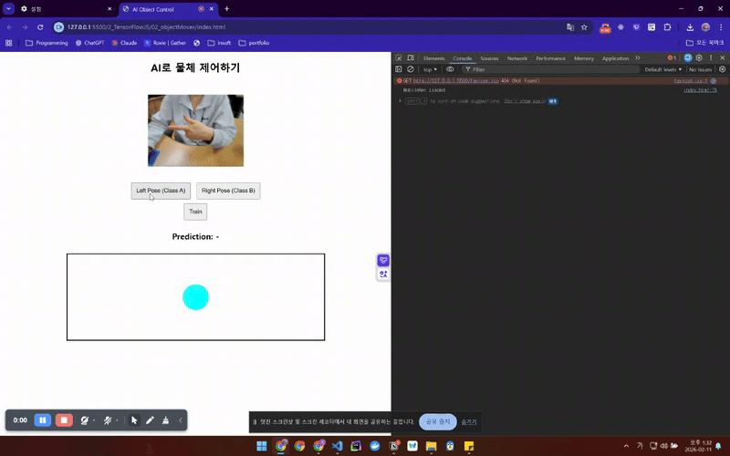

# AI로 물체 제어하기 (AI Object Control)

## 프로젝트 개요
웹캠을 통해 사용자의 포즈를 인식하고, 학습된 AI 모델로 화면의 공을 좌우로 제어하는 프로젝트입니다. TensorFlow.js와 MobileNet을 활용한 전이학습(Transfer Learning) 기반 실시간 이미지 분류 시스템입니다.

## 사용 기술
- **TensorFlow.js**: 브라우저에서 머신러닝 모델 실행
- **MobileNet**: 이미지 특징 추출을 위한 사전 학습된 모델
- **Canvas API**: 공의 움직임 시각화

## 코드 구조 분석

### 1. 모델 초기화
```javascript
async function setup() {
    webcam = document.getElementById("webcam");
    const stream = await navigator.mediaDevices.getUserMedia({ video: true });
    webcam.srcObject = stream;
    
    mobilenetModel = await mobilenet.load();
}
```
- 웹캠 스트림 연결
- MobileNet 사전 학습 모델 로드 (224x224 입력 크기)

### 2. 이미지 캡처 및 특징 추출
```javascript
function captureImage() {
    return tf.tidy(() => {
        const img = tf.browser.fromPixels(webcam)
            .resizeNearestNeighbor([224, 224])
            .toFloat()
            .expandDims();
        return mobilenetModel.infer(img, true);
    });
}
```
- 웹캠 영상을 224x224 크기로 리사이징
- MobileNet을 통해 고수준 특징 벡터 추출
- `tf.tidy()`로 메모리 누수 방지

### 3. 학습 데이터 수집
```javascript
function addExample(label) {
    const activation = captureImage();
    dataset.push(activation);
    labels.push(label);
}
```
- Class A (0): 왼쪽 포즈
- Class B (1): 오른쪽 포즈
- MobileNet의 출력(활성화 값)을 데이터셋으로 저장

### 4. 모델 학습
```javascript
async function train() {
    const xs = tf.concat(dataset);
    const ys = tf.oneHot(tf.tensor1d(labels, 'int32'), 2);
    
    model = tf.sequential();
    model.add(tf.layers.dense({
        inputShape: xs.shape.slice(1),
        units: 100,
        activation: 'relu'
    }));
    model.add(tf.layers.dense({
        units: 2,
        activation: 'softmax'
    }));
    
    model.compile({
        optimizer: tf.train.adam(0.0001),
        loss: 'categoricalCrossentropy',
        metrics: ['accuracy']
    });
    
    await model.fit(xs, ys, { epochs: 20 });
}
```
**신경망 구조:**
- 입력층: MobileNet 특징 벡터
- 은닉층: 100 뉴런 (ReLU 활성화)
- 출력층: 2 뉴런 (Softmax - 이진 분류)

**학습 설정:**
- Optimizer: Adam (학습률 0.0001)
- Loss: Categorical Crossentropy
- Epochs: 20

### 5. 실시간 예측 및 제어
```javascript
async function predict() {
    while (true) {
        const activation = captureImage();
        const prediction = model.predict(activation);
        const result = await prediction.data();
        
        if (result[0] > result[1]) {
            ballX -= 5; // 왼쪽 이동
        } else {
            ballX += 5; // 오른쪽 이동
        }
        
        ballX = Math.max(30, Math.min(570, ballX));
        drawBall();
        await tf.nextFrame();
    }
}
```
- 무한 루프로 실시간 예측
- 예측 결과에 따라 공을 5px씩 이동
- 경계 제한 (30 ~ 570)
- `tf.nextFrame()`으로 프레임 동기화


## 실행 화면 
 

## 사용 방법
1. 브라우저에서 `index.html` 열기
2. 웹캠 권한 허용
3. **Left Pose** 버튼 클릭 후 왼쪽 포즈 여러 번 캡처
4. **Right Pose** 버튼 클릭 후 오른쪽 포즈 여러 번 캡처
5. **Train** 버튼으로 학습 시작
6. 학습 완료 후 포즈를 취하면 공이 자동으로 이동

## 핵심 개념

### 전이학습 (Transfer Learning)
- MobileNet이 ImageNet으로 사전 학습된 특징 추출 능력을 활용
- 단순한 분류층만 추가로 학습하여 적은 데이터로도 효과적인 학습 가능
- 학습 시간 단축 및 성능 향상

### 실시간 분류
- 웹캠 프레임마다 예측 수행
- 브라우저에서 직접 실행되어 서버 통신 불필요

## 결론
이 프로젝트를 통해 브라우저 기반 실시간 이미지 분류 시스템을 구현할 수 있었습니다. 전이학습을 활용하여 간단한 포즈 인식이 가능하지만, **학습을 엄청 많이 다양하게 시켜야 제대로 분류해주는 것 같다는 생각이 들었습니다.** 다양한 조명 환경, 배경, 포즈 각도 등의 데이터를 충분히 학습시켜야 robust한 모델을 만들 수 있을 것으로 보입니다.

## 개선 방향
- 더 많은 클래스 추가 (상/하/좌/우 등)
- 데이터 증강(Data Augmentation) 적용
- 학습 데이터 수집 UI 개선
- 모델 저장/불러오기 기능 추가
- 예측 신뢰도(Confidence) 표시
